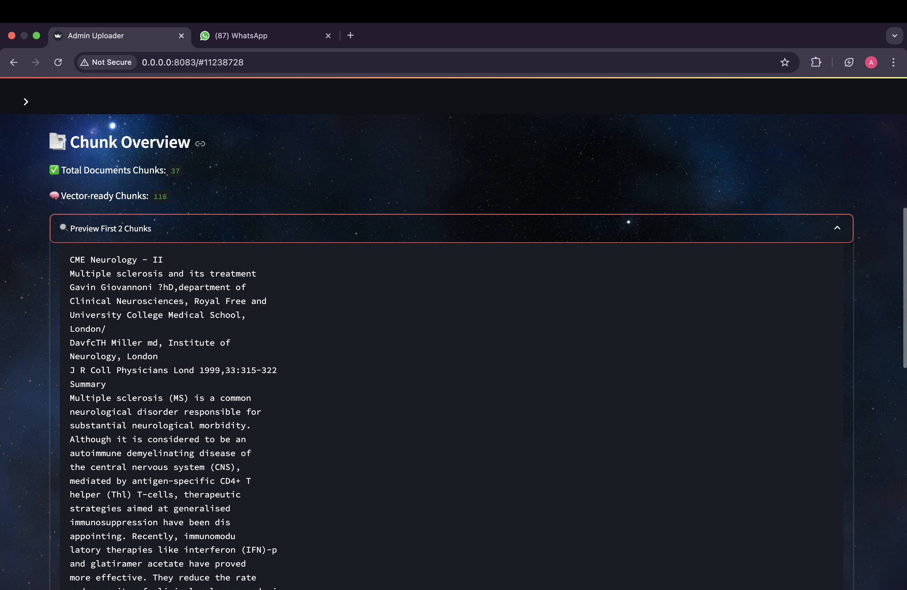

# 🧠 Domain-Specific RAG Chatbot

A Generative AI-powered application that allows users to chat with the contents of PDF documents using **Amazon Bedrock**, **Langchain**, **Python**, **Docker**, and **Amazon S3**. This project applies the Retrieval-Augmented Generation (RAG) technique to ground responses from an LLM in document-specific context.

---

## 🚀 Technologies Used

- **Amazon Bedrock** – For embeddings and LLM access
- **Langchain** – To orchestrate embeddings, retrieval, and LLM responses
- **Python** – Core logic and scripting
- **Docker** – Containerization of admin and user apps
- **Amazon S3** – Storage of vector indices
- **FAISS** – Fast similarity search for embeddings
- **Streamlit** – UI for uploading and interacting with PDFs

---

## Models Used

| Purpose           | Model Name                        | Model ID                        |
|------------------|-----------------------------------|---------------------------------|
| Text Embeddings  | Amazon Titan Embedding G1 - Text  | `amazon.titan-embed-text-v1`   |
| Language Model   | Amazon Titan Text Lite v1         | `amazon.titan-text-lite-v1`    |

---

## Architecture


## Project Components

This project has two independent applications:

### 1️⃣ Admin Application

**Goal:** Upload PDFs → Embed → Save FAISS index → Upload to S3

#### Flow:
1. Admin uploads a PDF file via Streamlit.
2. Text is extracted and chunked using Langchain’s `RecursiveCharacterTextSplitter`.
3. Embeddings for each chunk are generated using **Amazon Titan Embedding G1 - Text**.
4. These embeddings are stored in a local **FAISS** vector index.
5. The FAISS index is uploaded to **Amazon S3**.

#### 🔧 Run Instructions

```bash
# Build Docker image
docker build -t pdf-reader-admin .

# Run Admin app
docker run \
  -e BUCKET_NAME=<YOUR_S3_BUCKET_NAME> \
  -v ~/.aws:/root/.aws \
  -p 8083:8083 \
  -it pdf-reader-admin
```



---

### 2️⃣ User Application

**Goal:** Query PDF contents → Retrieve similar chunks → Generate answers

#### ✨ Flow:
1. FAISS index is downloaded from S3 on app startup.
2. User enters a question.
3. The question is embedded using **Amazon Titan Embedding G1 - Text**.
4. **Top 5 relevant chunks** are retrieved via similarity search on FAISS.
5. These chunks + the question are passed to a **PromptTemplate**.
6. A response is generated using **Amazon Titan Text Lite v1** via Bedrock.
7. The response is displayed in the Streamlit UI.

#### 🔧 Run Instructions

```bash
# Build Docker image
docker build -t pdf-reader-client .

# Run User app
docker run \
  -e BUCKET_NAME=<YOUR_S3_BUCKET_NAME> \
  -v ~/.aws:/root/.aws \
  -p 8084:8084 \
  -it pdf-reader-client
```


---


